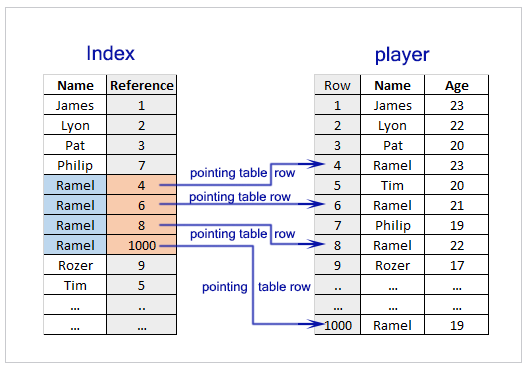
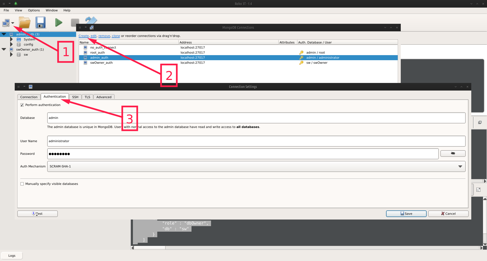

## MODIFICATION DES COLLECTIONS

MongoDB met à disposition plusieurs méthode de collection permettant de faire des requête de type INSERT, DELETE, UPDATE et REPLACE

### INSERT

Les insertions de documents sont gérées par les méthodes de collection insert(), insertOne() et insertMany() :
* insertOne() permet d'inserer 1 seul document
* insertMany() permet d'inserer plusieurs documents
* insert() permet d'insérer 1 ou plusieurs documents

Ces fonctions prennent le document à insérer en paramêtre.

Par défaut un paramêtre ***_id*** est automatiquement créé par mongodb lors de l'insertion.
Mais on a la possibilité de définir manuellement ***_id*** mais il doit obligatoirement être unique pour chaque document sinon une erreur est levée.

Ex : Insertion 1 document dans la collection _characters_ de la database _sw_ avec insertOne()

```javascript
//preparation du document
var doc = {
		"_id":1,
        "name": "Luke Skywalker",
		"gender": "male",
		"homeworld": "Tatooine",
		"species": "Human"
	}
//insertion du document dans la collection character
db.characters.insertOne(doc)

//insertion du document dans la collection character
db.characters.findOne()
=> Resultat : 
{
    "_id" : 1.0,
    "name" : "Luke Skywalker",
    "gender" : "male",
    "homeworld" : "Tatooine",
    "species" : "Human"
}

```

Ex: Insertion plusieurs document avec insert()

```javascript
var docs = [{
		"name": "C-3PO",
		"gender": null,
		"homeworld": "Tatooine",
		"species": "Droid"
	},
	{
		"name": "R2-D2",
		"gender": null,
		"homeworld": "Naboo",
		"species": "Droid"
	}]

db.characters.insert(docs)

db.characters.find()
=> Resultat :

/* 1 */
{
    "_id" : 1.0,
    "name" : "Luke Skywalker",
    "gender" : "male",
    "homeworld" : "Tatooine",
    "species" : "Human"
}

/* 2 */
{
    "_id" : 2.0,
    "name" : "C-3PO",
    "homeworld" : "Tatooine",
    "species" : "Droid"
}

/* 3 */
{
    "_id" : 3.0,
    "name" : "R2-D2",
    "homeworld" : "Naboo",
    "species" : "Droid"
}

```

Les méthodes insert() et insertMany() peuvent prendre un deuxième paramètre optionnel `{ordered:<bolean>}`.
Ce paramêtre permet de configurer l'ordre d'insertion dans la collection :
* Si _true_ les documents sont inséré dans l'ordre défini dans la requête.  
  En cas d'erreur lors de l'insertion d'un document, l'insertion des éléments suivant est ignorée
* Si _false_ les documents sont insérés dans le desordre.  
  Une erreur sur lors de l'insertion d'un document n'a auune incidence sur l'insertion des éléments suivants.


### DELETE

Les suppresions de documents sont gérées pas les méthodes de collection deleteOne(), deleteMany() et remove() :
* deleteOne() pour supprimer 1 seul document ()
* deleteMany() pour supprimer plusieurs documents
* remove() pour supprimer 1 ou plusieurs documents

Ces methodes prennent 2 paramêtres placé dans l'ordre suivant `deleteOne(filter, options)`: 
* _query_ : contient les paramêtres pour filter les documents à supprimer.
* _options_ : contient des options spécifiques pour l'update.  
  2 principales a retenir :
  * **justOne**: <boolean>, supprimer que le premier élément identifié pour la methode remove()
  * **hint** : <string|Document> Défini si la suppression ne doit s'appliquer que sur un index spécifique pour la méthode deleteOne().


Avec un paramêtre de requête vide la méthode deleteOne() supprime le premier document sinon il supprime le premier document renvoyé par le curseur.

Ex: deleteOne()

```javascript
//supression du premier document
db.characters.deleteOne({})

db.characters.find()

=> Resultat:
/* 1 */
{
    "_id" : 2.0,
    "name" : "C-3PO"
    "homeworld" : "Tatooine",
    "species" : "Droid"
}

/* 2 */
{
    "_id" : 3.0,
    "name" : "R2-D2",
    "homeworld" : "Naboo",
    "species" : "Droid"
}
```

Avec un paramêtre de requête vide les méthodes deleteMany() et remove() suppriment la totalité des documents de la collection.

Ex : remove()

```javascript
//supression du premier document
db.characters.remove({})

db.characters.find()

=> Resultat : // 0 elements

```

> Pour la suite du tutoriel on importe le fichier ***sw_characters.json*** dans la collection **characters** de la DB ***sw***. 

Le paramêtres de requête pour la selection des éléments à supprimer sont identiques à celles utilisées dans les méthodes find()...

Ex: Je veux supprimer toutes les documents avec une valeur _species_ à null

```javascript
//suppression des document avec species:null
var res = db.characters.remove({species:null})

//je fait un print de l'objet renvoyé 
print(res.toString())

=> Resultat:
WriteResult({ "nRemoved" : 5 }) //5 suppressions
```

On peut utiliser l'option _JustOne_ dans la méthode _remove()_ pour ne supprimer qu'un seul élément.

Ex :
```javascript 
var query = {species:null}

db.characters.remove(query, {justOne:true});

```

### UPDATE

Les updates de documents sont gérées par les méthodes de collection update(), updateOne() et updateMany() :
* updateOne() pour supprimer 1 seul document ()
* updateMany() pour supprimer plusieurs documents
* update() pour supprimer 1 ou plusieurs documents

Ces fonction prennent 3 paramêtres placés dans l'ordre suivant `update(filter, update, options)` :
* _filter_ : contient les paramêtres pour filter les documents à updater
* _update_ : contient les parametres d'update (objet ou pipeline)
* _options_ : contient des options spécifiques pour l'update

#### OPTIONS

Le paramêtre _options_ prend la forme d'un objet contenant des clès spécifique.
Il est utilisé en complément de notre parametre _update_ pour définir comment MongoDB doit réagir dans certaine situation.

On utilisera 3 clés principales pour notre besoin :

* **upsert**: <boolean>  
  Si le curseur renvoyé par _filter_ est vide, defini si un nouveau document décris par _update_ doit être intégré.
  Par défaut à _false_

* **arrayFilters**: [ <filterObject>, ... ]  
  Pour les updates sur les tableau défini des critère de filtre spécifique supplémentaires.
  Par défaut à _null_

* **hint**: <document|string>  
  Défini si l'update ne doit s'appliquer que sur un **index** spécifique.

* **multi**: <boolean>  
  Utilisé par la méthode _update()_ permet de définir si l'update doit s'effectuer sur le premier document renvoyé (multi:false) ou sur l'ensemble des documents renvoyés (multi:true).

#### FILTER

Le paramètre _filter_ est sous la même forme que les objets filtre utilisés dans les requête find(), findOne() et findMany()

#### UPDATE

Le parametre _update_ peut prendre la forme d'un objet ou d'un pipeline.  
Dans les 2 cas on utilise les [Update Operateur](https://docs.mongodb.com/manual/reference/operator/update-field/) pour définir les étapes de mise à jour.

##### LES OPERATEURS DE CHAMPS

* **Operateur \$set**

\$set permet de définir un nouveau champs avec une valeur ou remplacer la valeur d'un champs existant.

Ex: Ajout de 2 nouveaux champs modif et modif_count pour tous les documents

```javascript
//je prepare mon parametre update
var update = {$set:{
	//creation champs modif_date avec NOW
        "modif_date": new Date(),
	//creation champs modif_count:1
        "modif_count":1
    }}

//envoi de la requete, filtre vide pour updater tous les doc
db.characters.updateMany({}, update)

=> Resultat : 
/* 1 */
{
    "acknowledged" : true,
    "matchedCount" : 87.0,
    "modifiedCount" : 87.0
}

db.characters.findOne()
=> Resultat:

/* 1 */
{
    "_id" : 7,
    "name" : "R5-D4",
    "gender" : null,
    "homeworld" : "Tatooine",
    "species" : "Droid",
    "score" : 192,
    "modif_count" : 1.0,
    "modif_date" : ISODate("2021-02-04T07:38:09.077Z")
}
```

Autre Ex : Integrer des informations supplémentaires sur la planete Tatooine en remplaçant le champs homeworld existant

```javascript

//preparation des data
var tatooine = {'name':"Tatooine",
    'sector': 'Arkanis',
    'system':'Tatoo'}

//preparation du filtre
var filter = {homeworld:'Tatooine'}
//preparation du update : je remplace la valeur existante par mon objet tatooine
var update = {$set:{homeworld:tatooine}}

//envoi de la requete
var res = db.characters.updateMany(
    filter,
    update
)

print(res)

=> Resultat :
{
    "acknowledged" : true,
    "matchedCount" : 10.0,
    "modifiedCount" : 10.0
}

db.characters.findOne({"homeworld.name":"Tatooine"})

/* 1 */
{
    "_id" : 7,
    "name" : "R5-D4",
    "gender" : null,
    "homeworld" : {
        "name" : "Tatooine",
        "sector" : "Arkanis",
        "system" : "Tatoo"
    },
    "species" : "Droid",
    "score" : 192,
    "modif_count" : 1.0,
    "modif_date" : ISODate("2021-02-04T07:38:09.077Z")
}
```

Tester les connaissances : remplir les informations concernant _Naboo_ (Infos sur [Wookipedia](https://starwars.fandom.com/fr/wiki/))

* **Operateur \$unset**

\$unset permet de supprimer des champs de nos documents en utilisant le format `{$unset:{<champs1>:"", ...}}`.  

Ex: Supprimer le champs gender pour tous les documents décrivant un _Droid_.

```javascript
//filtre sur species
var filter = {species:"Droid"}

//update : suppression de gender 
var update = {$unset:{gender:""}}

//requete
var res = db.characters.updateMany(filter, update)

print(res)

=>Resultat :
/* 1 */
{
    "acknowledged" : true,
    "matchedCount" : 5.0,
    "modifiedCount" : 5.0
}

db.characters.findOne({species:"Droid"})

/* 1 */
{
    "_id" : 7,
    "name" : "R5-D4",
    "homeworld" : {
        "name" : "Tatooine",
        "sector" : "Arkanis",
        "system" : "Tatoo"
    },
    "species" : "Droid",
    "score" : 192,
    "modif_date" : ISODate("2021-02-04T07:38:09.077Z"),
    "modif_count" : 1.0
}

```

* **Operateur \$rename**

\$rename permet de renommer un ou plusieurs champs.

```javascript
//parametre update avec rename champs modif en modifications
var update = {
		$rename:{
			modif_date: "last_modif_date"
		}
	}

db.characters.updateMany({}, update)

db.characters.findOne()

=> Resultat :

/* 1 */
{
    "_id" : 7,
    "name" : "R5-D4",
    "homeworld" : {
        "name" : "Tatooine",
        "sector" : "Arkanis",
        "system" : "Tatoo"
    },
    "species" : "Droid",
    "score" : 192,
    "modif_count" : 1.0,
    "last_modif_date" : ISODate("2021-02-04T07:38:09.077Z")
}
```

* **Operateur \$inc**

\$inc permet d'incrémenter la valeur d'un champs en fonction de valeur mise en paramêtre.

Ex: Modification des Skywalker, j'incrémente le compteur _modif\_count_ je met à jour _last\_modif\_date_

```javascript

//filtre sur les skywalker
var filter = {name:{$regex:/Skywalker/i}}
var update = {
    //j'update last_modif_date avec un objet DATE (par défaut NOW)
    $set:{last_modif_date:new Date()},
    //j'incremente modif_count
    $inc:{modif_count:1}
}

var res = db.characters.updateMany(filter, update)

print(res)

=> Resultat:
{ "nMatched" : 3, "nUpserted" : 0, "nModified" : 3 }

db.characters.find(filter)

=> Resultat:

/* 1 */
{
    "_id" : 10,
    "name" : "Anakin Skywalker",
    "gender" : "male",
    "homeworld" : {
        "name" : "Tatooine",
        "sector" : "Arkanis",
        "system" : "Tatoo"
    },
    "species" : "Human",
    "score" : 154,
    "modif_count" : 2.0,
    "last_modif_date" : ISODate("2021-02-04T07:48:34.991Z")
}
...
```

* **Operateur \$currentDate**

\$currentDate nous permet d'intégrer un objet Timestamp() ou un objet Date() correspondant à ***NOW*** dans un champs des documents.

Le choix de l'objet (Timestamp ou Date) est fait au moyen de l'opérateur ***$type*** sous le format :

```json
    {$currentDate:{
        <champs>:{$type:<timestamp|date>}
    }
}
```

Ex: Modification de _Darth Vader_, j'incrémente le compteur _modif\_count_ et je met à jour _last\_modif\_date_ avec l'opérateur ***$currentDate***

```javascript
//filtre sur name : Darth Vader
var filter = {name:"Darth Vader"}

//update 
var update = {
            //j'update last_modif_date avec la current date type DATE
                $currentDate:{last_modif_date:{$type:'date'}},
            //j'incremente modif_count
                $inc:{modif_count:1}
            }

var res = db.characters.updateOne(filter, update)
print(res)
            
=> Resultat :
/* 1 */
{
    "acknowledged" : true,
    "matchedCount" : 1.0,
    "modifiedCount" : 1.0
}

db.characters.findOne(filter)

=> Resultat :
/* 1 */
{
    "_id" : 3,
    "name" : "Darth Vader",
    "gender" : "male",
    "homeworld" : {
        "name" : "Tatooine",
        "sector" : "Arkanis",
        "system" : "Tatoo"
    },
    "species" : "Human",
    "score" : 197,
    "modif_count" : 2.0,
    "last_modif_date" : ISODate("2021-02-04T08:21:34.447Z")
}
```

* **Operateurs \$min / \$max**

\$min ou $max permettent de modifier un champs seulement si la valeur de l'opérateur est supérieur (pour \$max) ou inférieur (pour \$min) à la valeur actuelle du champs.

Ex: Je decide de définir un score min à 50 et un score max à 150 pour chaque personnage.

```javascript
//update max pour remplacer les valeur inférieure à 50
var updateMax = { 
            $max:{score:50}
        }
//update min pour remplacer les valeur supérieure à 150
var updateMin ={ 
            $min:{score:150}
        }

//Mongo leve un conflit si les parametre min et max sont appliqué en même temps sur le meme champs
// donc update en 2 fois

db.characters.updateMany({}, updateMax)
var res = db.characters.updateMany({}, updateMin)

print(res)
=> Resultat :

/* 1 */
{
    "acknowledged" : true,
    "matchedCount" : 87.0, // 87 elements trouvé
    "modifiedCount" : 21.0 // 21 elements remplacé
}

db.characters.findOne()

=> Resultat :

/* 1 */
{
    "_id" : 7,
    "name" : "R5-D4",
    "homeworld" : {
        "name" : "Tatooine",
        "sector" : "Arkanis",
        "system" : "Tatoo"
    },
    "species" : "Droid",
    "score" : 150.0,
    "modif_count" : 1.0,
    "last_modif_date" : ISODate("2021-02-04T13:48:59.147Z")
}

```

Si les champs associés aux opérateurs \$min et \$max ne sont pas définis dans les documents, ils sont créé lors de l'opération avec la valeur donnée.

Ces opérateurs fonctionne également sur des données de type date sous le format suivant :

```javascript

var update = {
            $min:{date_field : Date("2021-02-04")}
        }

```

* **Operateur \$mul**

\$mul remplace la valeur d'un champs sa valeur initiale multiplié par le paramêtre associé au champs.
Il prend la forme suivante :

```json
// update du champs 1 par sa valeur multiplié par 2
// update du champs 1 par sa valeur multiplié par 5
{ 
    $mul: { <champs1>: 2, <champs2>:5} 
}
```

Si le champs passé en paramêtre n'existe pas il le créé avec une valeur 0.

* **Operateur \$setOnInsert**

\$setOnInsert est associé au paramêtre **upsert** de l'objet _options_.

Quand **upsert** est défini à **true** et que le paramêtre filter ne renvoi aucun résultat, le document défini par le paramêtre _update_ est inséré dans la collection.  

\$setOnInsert permet de définir des champs qui seront créés dans dans le document que si on se retrouve dans cette situation.

Ex : Je veux updater un Darth Vadrr, species Droid. Si il n'existe pas je veux le créér.

```javascript
// filter Darth Vader, species Droid
var filter = {name:"Darth Vader", species:'Droid'}

// update
var update = {
    //update du résultat avec les parametre
   $set:{name:"Robot Darth Vader","species":"Droid", "homeworld":"Unknow"},
   //Si il non existant, nouveau champ newEntry
   $setOnInsert:{"newEntry":true}
}
//option upsert pour cree le document si non existant
var options={upsert:true}

db.characters.updateMany(filter, update, options)

=> Resultat :

/* 1 */
{
    "acknowledged" : true,
    "matchedCount" : 0.0,
    "modifiedCount" : 0.0,
    "upsertedId" : ObjectId("601c30cdfa6df235afe252b8")
}


db.characters.findOne({name:"Robot Darth Vader"})

=> Resultat :

/* 1 */
{
    "_id" : ObjectId("601c30cdfa6df235afe252b8"),
    "name" : "Robot Darth Vader",
    "species" : "Droid",
    "homeworld" : "Unknow",
    "newEntry" : true
}

```

##### LES OPERATEURS DE TABLEAUX

Les opérateur de tableaux permettent d'appliquer des modifications sur des items précis d'un tableau contenus dans un champs.
Il permettent également d'ajouter ou de supprimer un items précis.

> Avant de décrire les opérateurs, on va intégrer un champs supplémentaire dans tous nos documents.
> Nom du champs : ***grades***, valeur : ***[85, 80, 92, 80]***.
> On utilise ***updateMany()***

* **Operateur \$**

Associé à un champs contenant un tableau \$ permet de modifier le premier item, identifié par le filtre, du tableau.  

Ex : Pour tous les _Droid_ remplacer le premier grades code 80 par le grade code 81.

```javascript
//filtre sur species droid et les items 80 de grades
var filter = {species:'Droid', grades: 80}

// grades.$ represente l'index du premier item trouve
// je remplace sa valeur par 81
var update = {
   $set:{"grades.$": 81 }
}
        
db.characters.updateMany(filter, update)

=> Resultat
/* 1 */
{
    "acknowledged" : true,
    "matchedCount" : 5.0,
    "modifiedCount" : 5.0
}

db.characters.findOne({species:'Droid'})

=> Resultat :
{
    "_id" : 7,
    "name" : "R5-D4",
    "homeworld" : {
        "name" : "Tatooine",
        "sector" : "Arkanis",
        "system" : "Tatoo"
    },
    "species" : "Droid",
    "score" : 150.0,
    "modif_count" : 1.0,
    "last_modif_date" : ISODate("2021-02-04T13:48:59.147Z"),
    "grades" : [ 
        85.0, 
        81.0, //item à 81
        92.0, 
        80.0
    ]
}
```

* **Opérateur $[]**

Associé à un champs contenant un tableau \$[] permet de modifier tous les items du tableau par une valeur donnée. 

Ex : Remplacer tous les grades associé à Darth Vader par 100.

```javascript

var filter = {name:"Darth Vader"}
var update = {
   $set:{"grades.$[]": 100 }
}
        
db.characters.updateOne(filter, update)

=>Resultat:
/* 1 */
{
    "acknowledged" : true,
    "matchedCount" : 1.0,
    "modifiedCount" : 1.0
}

db.characters.findOne({species:'Human'})

=> Resultat : /* 1 */
{
    "_id" : 3,
    "name" : "Darth Vader",
    "gender" : "male",
    "homeworld" : {
        "name" : "Tatooine",
        "sector" : "Arkanis",
        "system" : "Tatoo"
    },
    "species" : "Human",
    "score" : 150.0,
    "modif_count" : 2.0,
    "last_modif_date" : ISODate("2021-02-04T13:48:59.156Z"),
    "grades" : [ 
        100.0, 
        100.0, 
        100.0, 
        100.0
    ]
}
```

* **Operateur $[\<identifier\>]**

Cet opérateur est lié au parametre _arrayFilters_ de l'objet _options_.

Associé à un champs contenant un tableau \$[\<identifier\>] permet de modifier un/des éléments spécifique en fonction du résultats renvoyé par le tableau _arrayFilters_.

L'objet passé en valeur de arrayFilters est similaire à ceux utilisés par les methode find()... 

Ex: Dans le document décrivant Obi-Wan Kenobi je veux remplacer les valeur de grade inférieure à 85 par la valeur 82.

```javascript
// filtre sur name
var filter = {name:"Obi-Wan Kenobi"}

// update de tous les items renvoyé par arrayFilter. 
// remplacement de la valeur existante par 82
var update = {$set:{"grades.$[item]":82}}

// option arrayFilter format tableau, recherche des item < 85
var options = {arrayFilters:[
                    {"item":{$lt:85}}
                    ]
               }

db.characters.updateOne(filter, update, options)

=> Resultat :

/* 1 */
{
    "acknowledged" : true,
    "matchedCount" : 1.0,
    "modifiedCount" : 1.0
}

db.characters.findOne(filter)

=> Resultat :

/* 1 */
{
    "_id" : 9,
    "name" : "Obi-Wan Kenobi",
    "gender" : "male",
    "homeworld" : "Stewjon",
    "species" : "Human",
    "score" : 96,
    "modif_count" : 1.0,
    "last_modif_date" : ISODate("2021-02-04T13:48:59.147Z"),
    "grades" : [ 
        85.0, 
        82.0, 
        92.0, 
        82.0
    ]
}
```
* **Operateur \$pop** 

L'opérateur \$pop peut prendre 2 valeurs : 1 ou -1
Il permet de supprimer le premier élément (valeur 1) ou le dernier élément (valeur -1) d'un tableau.

Ex : Dans le document décrivant Anakin Skywalker je veux supprimer le dernier item de grades.

```javascript
//filter _id : 10 
var filter = {"_id" : 10}
// suppression de dernier item de grades
var update = {$pop:{grades:-1}}

db.characters.updateOne(filter, update)

=> Resultat:
/* 1 */
{
    "acknowledged" : true,
    "matchedCount" : 1.0,
    "modifiedCount" : 1.0
}

db.characters.findOne(filter)

=> Resultat:

/* 1 */
{
    "_id" : 10,
    "name" : "Anakin Skywalker",
    "gender" : "male",
    "homeworld" : {
        "name" : "Tatooine",
        "sector" : "Arkanis",
        "system" : "Tatoo"
    },
    "species" : "Human",
    "score" : 150.0,
    "modif_count" : 2.0,
    "last_modif_date" : ISODate("2021-02-04T13:48:59.154Z"),
    "grades" : [ 
        80.0, 
        92.0, 
        80.0
    ] // le dernier item a ete supprime
}
```

* **Operateur \$pull / \$pullAll**

\$pull permet de supprimer les éléments d'un tableau en fonction de l'objet filtre passé en valeur.

Ex : Dans le document décrivant Chewbacca je veux supprimer les valeurs de grade supérieur à 90.

```javascript
// filtre
var filter = {name:"Chewbacca"}

// upgrade : suppression item supérieur à 90
var update = {$pull:{grades:{$gt:90}}}

db.characters.updateOne(filter, update)

=> Resultat :
/* 1 */
{
    "acknowledged" : true,
    "matchedCount" : 1.0,
    "modifiedCount" : 1.0
}

db.characters.findOne(filter)

=> Resultat :
/* 1 */
{
    "_id" : 12,
    "name" : "Chewbacca",
    "gender" : "male",
    "homeworld" : "Kashyyyk",
    "species" : "Wookiee",
    "score" : 150,
    "modif_count" : 1.0,
    "last_modif_date" : ISODate("2021-02-04T13:48:59.147Z"),
    "grades" : [ 
        85.0, 
        80.0, 
        80.0
    ]// valeur 92 supprime
}
```

\$pullAll est similaire à \$pull mais il prend en valeur un tableau.   
Toutes les valeurs égales à celles contenues dans le tableau sont supprimées.

```javascript
// suppression des valeurs 85,88,90 et 95 dans le tableau grades 
var update = {$pullAll:{grades:[85,88,90,95]}}

```

* **Operateur \$push**
  
\$push permet d'ajouter un/des éléments dans un tableau.  

En utilisant le format `{<champs>:valeur}` il permet d'insérer un élément unique à la fin du tableau.

Des opérateurs de modification permettent de faire des insertions plus spécifique :

* \$each : permet d'insérer plusieur éléments listé dans un tableau.
* \$position : permet de selectionner la position d'insertion. 
  Il indique la position de l'index à partir du début du tableau si positif, à partir de la fin si négatif
* \$sort : permet de trier les éléments insérés
  Il peut prendre comme valeur 1 (ascending), -1 (descending) ou un objet listant les champs du tableau avec l'ordre du tri (-1 ou 1) en valeur.
* \$slice : permet de selectionner les éléments et le nombre d'éléments intégrés dans le tableau final.
  Il prend en valeur :
  * 0 : tableau final vide
  * valeur positive : premiers éléments dans le tableau final
  * valeur negative : derniers éléments dans le tableau final
  

Ex : Dans le document décrivant C-3PO, j'intègre les valeurs **[75, 94, 83]** dans le tableau grades.
Je veux garder uniquement les 4 valeurs les plus faible après update.


```javascript

=> Document avant update

* 13 */
{
    "_id" : 1,
    "name" : "C-3PO",
    "homeworld" : {
        "name" : "Tatooine",
        "sector" : "Arkanis",
        "system" : "Tatoo"
    },
    "species" : "Droid",
    "score" : 50.0,
    "modif_count" : 1.0,
    "last_modif_date" : ISODate("2021-02-04T13:48:59.147Z"),
    "grades" : [ 
        85.0, 
        81.0, 
        92.0, 
        80.0
    ]
}

=> Requete :
//filtre
var filter = {name:"C-3PO"}
//update
var update = {
    //ajout dans tableau grades avec $push
    $push:{
        grades:{
            //ajout de plusieurs valeur avec $each
            $each:[75, 94, 83],
            //à la position 0 du tableau grades
            $position:0,
            //tri croissant du tableau grade après insertion
            $sort: 1,
            //je garde uniquement les 4 premiers élément du tableau grades
            $slice:4
    }
}}

db.characters.updateOne(filter, update)
=> Resultat :

/* 1 */
{
    "acknowledged" : true,
    "matchedCount" : 1.0,
    "modifiedCount" : 1.0
}

db.characters.findOne(filter)
=> Resultat
/* 1 */
{
    "_id" : 1,
    "name" : "C-3PO",
    "homeworld" : {
        "name" : "Tatooine",
        "sector" : "Arkanis",
        "system" : "Tatoo"
    },
    "species" : "Droid",
    "score" : 50.0,
    "modif_count" : 1.0,
    "last_modif_date" : ISODate("2021-02-04T13:48:59.147Z"),
    "grades" : [ //4 valeurs trié en ascending 
        75.0, 
        80.0, 
        81.0, 
        83.0
    ]
}
```

> ATTENTION : Essayer d'intégrer un tableau de données sans l'opérateur \$each donne le résultat suivant : `grades : [81,83, [75,94]]`

* **Operateur $addToSet**

\$addToSet permet d'ajouter un/des éléments dans un tableau comme si c'était un objet Set().
Si l'élément est déjà présent dans le tableau d'origine, il est ignoré.

On peut le coupler avec l'opérateurs de modification \$each pour intégrer plusieurs éléments.

Ex: Dans le document décrivant C3-PO, je veux ajouter les valeurs de grade **[72, 81, 83, 92]** si elle ne sont pas déjà présentes.

```javascript

var filter = {name:"C-3PO"}
var update = {$addToSet:
                {grades:
                    {$each:[72, 81, 83, 92]}
                }
            }
db.characters.updateOne(filter, update)

=> Résultat :
/* 1 */
{
    "acknowledged" : true,
    "matchedCount" : 1.0,
    "modifiedCount" : 1.0
}
db.characters.findOne(filter) 
=> Resultat:

/* 1 */
{
    "_id" : 1,
    "name" : "C-3PO",
    "homeworld" : {
        "name" : "Tatooine",
        "sector" : "Arkanis",
        "system" : "Tatoo"
    },
    "species" : "Droid",
    "score" : 50.0,
    "modif_count" : 1.0,
    "last_modif_date" : ISODate("2021-02-04T13:48:59.147Z"),
    "grades" : [ /
        75.0, 
        80.0, 
        81.0, 
        83.0, 
        72.0, 
        92.0
    ]
    //seules les valeur non présentes dans le tableau 
    //d'origine sont intégrées
}
```

##### UPDATE AVEC PIPELINE

Le paramètre _update_ des methode updateOne(), updateMany() et update() peuvent également être sous la forme d'un pipeline (liste de stage).
Dans cette configuration seul les stages suivant sont disponible:
* \$addField (opérateur \$set) => créer /updater des champs
* \$project (opérateur \$unset) => supprimer des champs
* \$replaceRoot (opérateur \$replaceWith) => remplacer un document

Ex: Dans le documents décrivant le droid "R5-D4" , concaténer les opérations :
* compléter le homeworld
* supprimer le champs gender

```javascript
//filtre
var filter = {'name': "R5-D4"}
//update sous la forme d'un pipeline (liste de stage)
var update = [
    //stage set pour updater homeworld
    $set:{
        "homeworld":{
            "name" : "Tatooine",
            "sector" : "Arkanis",
            "system" : "Tatoo"
        }
    },
    //stage unset pour supprimer gender
    $unset:{gender:""}
]

var res = db.characters.update(filter, update)
```

### REPLACE

La methode _replaceOne()_ permet de remplacer un élément dans la collection.

Elle prend 3 paramètres placés dans l'ordre suivant `replaceOne(filter, replacement, options)` :
* _filter_ : idem paramètre update.
* _replacement_ : document à intégrer.
* _options_ : options similaires à celles utilisées dans l'update.
  2 options à retenir:
  * **upsert**:<boolean> : Si le curseur renvoyé par _filter_ est vide, defini si le document de remplacement doit être ajouté.
  * **hint**: <document|string> : option identique à celle utilisée dans l'update.

Ex : Remplacement du document décrivant Robot Darth vader

```javascript
//filter
var filter = {name:"Robot Darth Vader"}
//document de remplacement
var replacement = {
        "name" : "Robot Darth Vader",
        "species" : "Droid",
        "homeworld" : "Unknow"
    }
db.characters.replaceOne(filter, replacement)

=> Resultat :

/* 1 */
{
    "acknowledged" : true,
    "matchedCount" : 1.0,
    "modifiedCount" : 1.0
}

db.characters.findOne(filter)  

=> Résultat :

/* 1 */
{
    "_id" : ObjectId("601c30cdfa6df235afe252b8"),
    "name" : "Robot Darth Vader",
    "species" : "Droid",
    "homeworld" : "Unknow"
}
```

### VALEUR DE RETOUR

En cas de succès des fonction xxxxOne() et xxxxMany() (inserOne(), insertMany(), deleteOne()...) renvoie un objet contenant le status de la requête et les _\_id_ des documents inséré.

```json
/* 1 */
{
    "acknowledged" : true, // requete reconnu : true
    "insertedId" : [1.0, 2.0] // _id des documents iséré
}
```

En cas de défaut ses 2 fonction renvoi un objet de type **WriteError**.

Ex: Insertion d'un document avec un _\_id_ existant.
```json
WriteError({
	"index" : 0,
	"code" : 11000,
	"errmsg" : "E11000 duplicate key error collection: sw.characters index: _id_ dup key: { : 1.0 }",
	"op" : [{
		"_id" : 1,
		"name" : "Luke Skywalker",
		"gender" : "male",
		"homeworld" : "Tatooine",
		"species" : "Human"
    },
    {   
        "_id":2,
		"name": "C-3PO",
		"homeworld": "Tatooine",
		"species": "Droid"
	}]
})
```

En cas de succès des fonction insert(), update(), remove() l'objet renvoyé est un objet plus complexe de type [WriteResult](https://docs.mongodb.com/manual/reference/method/db.collection.insert/#writeresult).

```json
{
	"writeErrors" : [ ],
	"writeConcernErrors" : [ ],
	"nInserted" : 1,
	"nUpserted" : 0,
	"nMatched" : 0,
	"nModified" : 0,
	"nRemoved" : 0,
	"upserted" : [ ]
}

```

En cas de défaut elle renvoi également un objet WriteResult contenant un objet writeError décrivant l'erreur.

```json
{
	"writeErrors" : [
		{
			"index" : 0,
			"code" : 11000,
			"errmsg" : "E11000 duplicate key error collection: sw.characters index: _id_ dup key: { : 4.0 }",
			"op" : {
				"_id" : 4,
				"name" : "Luke Skywalker",
				"gender" : "male",
				"homeworld" : "Tatooine",
				"species" : "Human"
			}
		}
	],
	"writeConcernErrors" : [ ],
	"nInserted" : 0,
	"nUpserted" : 0,
	"nMatched" : 0,
	"nModified" : 0,
	"nRemoved" : 0,
	"upserted" : [ ]
}
```

### FIND AND PROCESS

MongoDB comporte aussi des méthodes de collection permettant de récupérer les éléments actuel avant faire des modification sur la base :
* [findAndModify](https://docs.mongodb.com/manual/reference/method/db.collection.findAndModify/)
* [findOneAndDelete](https://docs.mongodb.com/manual/reference/method/db.collection.findOneAndDelete/)
* [findOneAndReplace](https://docs.mongodb.com/manual/reference/method/db.collection.findOneAndReplace/)
* [findOneAndUpdate](https://docs.mongodb.com/manual/reference/method/db.collection.findOneAndUpdate/)

Le fonctionnement de ces méthodes est similaire au méthode standard décrite plus haut.
Pour plus d'info, veuillez consulter la documentation.


### METHODE DISTINCT

La methode de collection _distinct()_ permet de lister les valeur unique d'un champs passé en premier paramêtre.

On peut intégrer un deuxième paramêtre _query_ à distinct() pour filtrer les documents utilisés lors de l'opération distinct()

Ex : Dans la base sw lister les _species_ présente sur le _homeworld_ _Kamino_

```javascript
var query = {"homeworld":"Kamino"};

db.characters.distinct("species", query);

=> Resultat:
/* 1 */
[
    "Human",
    "Kaminoan"
]
```

### LES INDEX MONGODB

Au fur et à mesure que les collections grandissent, les temps d'éxecution des requête s'allonge.

Pour récupérer un/des document(s) via un _find_ MongoDB va devoir parcourir l'ensemble de la collection jusqu'à trouver le/les bons éléments.
C'est un **collectionScan**.
Si la collection comprend plusieurs centaines de millier de documents cette requête peut devenir très gourmande en ressources matériel.

Pour remédier à cette situation, le systeme nous donne l'occasion d'ajouter des index MongoDB sur les collections.

Les index sont un copie d'un segment de données au format [B-Tree](https://en.wikipedia.org/wiki/B-tree)



MongoDB va pouvoir, via un **indexScan**, identifier plus rapidement et efficacement les documents ciblé par la requête.
Techniquement il va parcourir **un seul document** (notre index) pour identifier les références aux documents ciblés.

#### CREER UN INDEX

Pour créer un index dans une collection on utilise la méthode de collection _createIndex_.

Il prend en premier paramêtre un objet décrivant le/les champs à indexer et l'ordre de tri pour chacun.

Il peut prendre un deuxième paremètre une liste d'_options_ spécifiques dont celle à retenir:
* unique <boolean> : pour la creation d'un index unique pour un champs, la collection ne peur contenir 2 fois la même valeur pour le champs.
* name <string> : nom de l'index.
* partialFilterExpression <document> : paramêtre _filtre_ pour une selection plus fine des documents indexés.
* hidden <boolean> : defini si l'index est caché, tant qu'un index est caché, il n'est pas pris en compte par MongoDB. 

Ex: Dans la DB sw, création d'un index sur le champs _species_ en tri croissant.
Je le nomme species_inc.

```javascript
db.characters.createIndex({species:1}, {name:"species_inc"})

=> Resultat:
/* 1 */
{
    "createdCollectionAutomatically" : false,
    "numIndexesBefore" : 1,
    "numIndexesAfter" : 2,
    "ok" : 1.0
}
```

> Si l'option name n'est pas spécifié, le nom de l'index est défini par mongoDB sous le format `<champs>_<valeur>`, ex ci-dessus : `species_1`


#### SIGLE FIELD INDEX

Un sigle field index sert à appliquer un index sur un seul champs de la collection.

Cet index sera automatiquement utilisé par MongoDB pour effectuer un **indexScan** pour toute les requêtes intégrants ce filtre en premier critère de recherche (sauf si l'index est en hidden).


Donc l'index `{species:1}` créé ci-dessus sera utilisé pour toutes les requête intégrant un _filter_ sur le champs _species_ comme premier critère de recherche.
Donc pour les requêtes suivantes :

```javascript
//mongoDB parcours l'index pour identifier documents décrivant des Human
db.characters.find({species:"Human"})
//mongoDB parcours l'index pour identifier les documents décrivant les Human puis parcours les documents identifiés pour récupérer les homeworld:Tatooine.
db.characters.find({species:"Human", homeworld:"Tatooine"})
```

Mais mongoDB ne pourra pas effectuer d'**indexScan** pour des requêtes n'intégrant pas le champs (il devra réaliser un **collectionScan**): 

```javascript
db.characters.find{homeworld:"Tatooine"})
db.characters.find()
```

Les méthodes _sort()_ peuvent également utiliser l'index pour de meilleur performances quelque soit le sens defini dans la fonction:

```javascript
db.characters.find{homeworld:"Tatooine"}).sort({species:-1})
```

> On peut également définir un index en utilisant les sous champs.
  Ex : Creation d'un un index descending sur le champs _homeworld_, sous champs _name_
  `sw.characters.createIndex({homeworld.name:-1})`

#### COMPOUND FIELD INDEX

Un compound field index permet de créer un index intégrant plusieurs champs.

Ex: Sur la DB sw, création d'un index sur les champs _homeworld_ et _species_

```javascript
db.characters.createIndex({homeworld:-1, species:1})

=> Resultat:
/* 1 */
{
    "createdCollectionAutomatically" : false,
    "numIndexesBefore" : 2,
    "numIndexesAfter" : 3,
    "ok" : 1.0
}
``` 

Suite à la création de l'index ci-dessu, les requêtes contenant un _filter_ sous la forme `{homeworld:<valeur>, species:<valeur>}` seront processés en **indexScan** par MongoDB.

Un compound index peut être représenté comme une arborescence d'index.
Ou chaque étage de l'arborescence est un prefix de l'étage suivant

Ex sur l'index : `{<champs1>:valeur, <champs2>:valeur, <champs3>:valeur}`
* prefix1 : `{\<champs1\>:valeur}`
* prefix2 : `{\<champs1\>:valeur, \<champs2\>:valeur}` 
* index :   `{\<champs1\>:valeur, \<champs2\>:valeur, \<champs3\>:valeur}`

Ce format a un avantage, il permet que les requête contenant un _filter_ sous la forme du compound field index ou d'un de ses prefix puissent être processé en mode indexScan.

En contrepartie, l'ordre des prefix est important.
Un _filter_ sous la forme `{\<champs2\>:valeur, \<champs3\>:valeur}` ou `{\<champs3\>:valeur, \<champs1\>:valeur}` ne seront pas processé en indxScan (ils seront donc processé en collectionScan).

La methode sort() pourra également profiter des avantages du compound field index (et de ses prefix) tant qu'il respecte les contraites suivante :
* l'ordre du sort doit correspondre à l'index.
  index : `{homeworld:-1, species:1}`; sort : `sort({homeworld:-1, species:1})`
* l'ordre du sort doit être strictement l'inverse de l'index.
  index : `{homeworld:-1, species:1}`; sort : `sort({homeworld:1, species:-1})`

Donc les fonction requêtes suivantes ne pourront pas être processé en indexScan : `sort({homeworld:1, species:-1})`

#### TEXT INDEX

Les _text index_ sont des index spécifiques qui nous permettent de faire de la recherche de texte lors de nos requêtes.

On les déclare en utilisant la formulation suivante:

```json
{
    <champs1>:"text",
    <champs2>:"text",
    ....
}
```

MongoDB pourra effectuer une recherche de texte dans tous les champs déclaré en type text dans un index.

Ex : Création d'un index de type text sur les champs _name_ et _homeworld_ de la collection _characters.

```javascript
sw.characters.createIndex(
    {
        name:"text",
        homeworld:"text"
        }
)
=> Resultat:

/* 1 */
{
    "createdCollectionAutomatically" : false,
    "numIndexesBefore" : 1,
    "numIndexesAfter" : 2,
    "ok" : 1.0
}

//requete utilisant le text index
//recherche de R2 et/ou C-3PO sur les champs name et homeworld

var query = {$text:{$search:"R2 C-3PO"}}

=> Resultat :
* 1 */
{
    "_id" : 1,
    "name" : "C-3PO",
    "homeworld" : "Tatooine",
    "species" : "Droid",
    "score" : 50.0,
    "modif_count" : 1.0,
    "last_modif_date" : ISODate("2021-02-04T13:48:59.147Z"),
    "grades" : [ 
        75.0, 
        80.0, 
        81.0, 
        83.0, 
        72.0, 
        92.0
    ]
}

/* 2 */
{
    "_id" : 2,
    "name" : "R2-D2",
    "homeworld" : "Naboo",
    "species" : "Droid",
    "score" : 50.0,
    "modif_count" : 1.0,
    "last_modif_date" : ISODate("2021-02-04T13:48:59.147Z"),
    "grades" : [ 
        85.0, 
        81.0, 
        92.0, 
        80.0
    ]
}
```

Pour indexer automatiquement tout les champs de type string on utilise la formulation suivante :

```json
{
    "$**":"text
}
```

#### MANAGER LES INDEX

##### LISTER LES INDEX

Pour récupérer la liste des index on utilise la méthode de collection _getIndexes()_

Ex : récupérer la liste des index de la collection _characters_ de _sw_

```javascript

db.characters.getIndexes()

=> Resultat
/* 1 */
[
    {
        "v" : 2,
        "key" : {
            "_id" : 1
        },
        "name" : "_id_"
    },
    {
        "v" : 2,
        "key" : {
            "species" : 1.0
        },
        "name" : "species_inc"
    },
    {
        "v" : 2,
        "key" : {
            "species" : 1.0,
            "homeworld" : -1.0
        },
        "name" : "species_1_homeworld_-1"
    }
]
```

##### SUPPRIMER LES INDEX

Pour supprimer un index on utilise la méthode de collection _dropIndex()_
On lui donne le nom de l'index ou l'objet le définissant en paramêtre.

Ex : suppression de l'index `{species:1}` créé plus haut avec le nom species_inc

```javascript
db.characters.dropIndex("species_inc")

=> Resultat:
/* 1 */
{
    "nIndexesWas" : 3,
    "ok" : 1.0
}
```

Pour supprimer un ou plusieurs index on utilise la methode de collection _dropIndexes()_.
Elle prend en paramêtre :
* pour supprimer un index : le nom de l'index ou l'objet le définissant
* pour supprimer plusieurs index : liste de nom ou liste d'objets
* pour supprimer tous les index (sauf le _id); pas de paramêtres.

Ex : suppression de tous les index de la collection characters

```javascript

db.characters.dropIndexes()

=> Resultat :

/* 1 */
{
    "nIndexesWas" : 2,
    "msg" : "non-_id indexes dropped for collection",
    "ok" : 1.0
}
```

##### ACTIVER/DESACTIVER UN INDEX

La méthodes hideIndex() permet de desactiver l'index (sans le supprimer).
Quand un index est desactivé, il n'est plus utilisé par MongoDB.
La methode unhideIndex() permet de le réactiver.

Ces méthodes prennent le nom de l'index  ou un objet le définissant en paramêtre.

Ex : desactiver l'index species_inc
`db.characters.hideIndex("species_inc")`

Activer/Desactiver un index permet d'évaluer les écarts de performances lors du processing des requêtes.

##### AFFICHER LA TAILLE DES INDEX

Les index sont très utile mais leur utilisation n'est pas gratuite.
Ce sont des documents qui liste les références vers le données de collection.

Ces documents ont une taille qui augmente la taille de notre base.
La méthode _totalIndexSize()_ permet d'afficher la taille des index.

## MANAGER LES COLLECTIONS

### CREATION DE COLLECTION

Comme vu précédement, la premiere insertion d'un document créé la ciblé collection automatiquement.
Mais on peut égalemnet utiliser la fonction de Database [_createCollection_](https://docs.mongodb.com/manual/reference/method/db.createCollection/index.html)

Cette fonction prend en premier paramêtre le nom de la collection mais permet d'intégrer quelques options spécifique interressantes en deuxième paramêtre comme :
* capped \<boolean\> : defini si la collection est de type plafonné (collection avec une taille max).
* size: la taille max de la collection en octet. Dès que la taille est dépassé, les plus anciens documents sont supprimé à chaque nouvelles insertions.
* max : le nombre de documents max acceptés. Dès que la taille est dépassé, les plus anciens documents sont supprimé à chaque nouvelles insertions. 

Avant ou après création de la collection on peut vérifier sa présence dans la base avec la méthode de collection _exists()_

Ex : Creation d'une collection de type capped nommée _starship_ dans la database _sw_, taille max de la collection 15Mo.

```javascript

var cname = "starship" //nom de la collection

var options = {
                "capped":true, //taille plafonne
                "size":15000, //taille max 15M
             } 

//creation de la collection       
db.createCollection(cname, options)

=> Resultat :

/* 1 */
{
    "ok" : 1.0
}

//controle starship exists
db.starship.exists()

=> /* 1 */
{
    "name" : "starship",
    "type" : "collection",
    "options" : {
        "capped" : true,
        "size" : 15104
    },
    "info" : {
        "readOnly" : false,
        "uuid" : UUID("ea7b7b37-088b-4a71-81a5-ac71c5756a99")
    },
    "idIndex" : {
        "v" : 2,
        "key" : {
            "_id" : 1
        },
        "name" : "_id_"
    }
}

//controle momo exists
db.momo.exists()
=> Resultat :
null

```

> La méthod _createCollection()_ comporte d'autre options pour gérer les validation ou les copie de collection.
> Pour plus d'info, voir la [doc](https://docs.mongodb.com/manual/reference/method/db.createCollection/index.html)


### INFORMATIONS DE COLLECTIONS

La methode de database _getCollectionsNames()_ permet d'afficher la liste des nom de collections.

Ex : afficher le nom des collection de _sw_
```javascript
db.getCollectionNames()
=> Resultat :
/* 1 */
[
    "characters",
    "starship"
]

```

La méthode _getCollectionsInfos()_ permet d'obtenir toutes les informations sur les collections.
Sans paramêtre, cette méthode renvoi toutes les informations de toutes les collections de la database.

```javascript

db.getCollectionInfos()

=> Resultat:
/* 1 */
[
    {
        "name" : "characters",
        "type" : "collection",
        "options" : {},
        "info" : {
            "readOnly" : false,
            "uuid" : UUID("12befc62-ce24-48a8-b198-183ed8eba6ba")
        },
        "idIndex" : {
            "v" : 2,
            "key" : {
                "_id" : 1
            },
            "name" : "_id_"
        }
    },
    {
        "name" : "starship",
        "type" : "collection",
        "options" : {
            "capped" : true,
            "size" : 15104
        },
        "info" : {
            "readOnly" : false,
            "uuid" : UUID("ea7b7b37-088b-4a71-81a5-ac71c5756a99")
        },
        "idIndex" : {
            "v" : 2,
            "key" : {
                "_id" : 1
            },
            "name" : "_id_"
        }
    }
]
```

On peut intégrer à cette fonction un paramêtre de type _filter_ et un paramêtre de type _projection_ pour selectionner les informations qui nous intéressent. 

Ex: Récupérer les options de la collections starship.
```javascript

db.getCollectionInfos({name:"starship"},{options:1})

=> Resultat :

/* 1 */
[
    {
        "name" : "starship",
        "type" : "collection"
    }
]


```

### SUPPRESSION D'UNE COLLECTION

La methode de collection _drop()_ permet de supprimer la collection ciblée.

Ex: suppression de la collection _starship_ de _sw_.

```javascript

db.starship.drop()

=>Resultat :
true 

```

### SUPPRESSION D'UNE DATABASE

Pour supprimer une database on utilise la méthode de Database _dropDatabase()_
On peut integrer des option à cette méthode, dont l'option _comment_ 
Ex : 

## ADMINISTRATION ROLE ET USERS

Le contrôle de l'accès aux fonctions et au contenue d'une base mongoDB est basé sur le système de **rôle**.

Ces rôles s'applique sur une Database (local ou systeme) et peut appliquer un accès jusqu'à un niveau de granularité Collection.

Chaque **rôle** accorde des privilèges bien défini pour effectuer :
* des actions (read, write ...)
* du monitoring
* de l'administration utilisateur (user, roles)
* de l'administration db (index, duplication, backup, restore)
...

On **accorde** ensuite ces **rôles** aux **Users** pour définir leurs droit. 

MongoDB possède une série de **rôles prédéfinis** (Built-In roles) qui fournissent les différents niveaux d'accès généralement nécessaires dans un système de base de données.
Mais il donne aussi l'occasion à l'administrateur de **créer ses propres rôles**.

### LES ROLES PREDEFINI

Les rôles prédéfinis nous permettent d'attribuer des droit facilement sur une database pour des profils standard (root, admin, reader ...).

Certain rôles sont applicables à l'ensemble de nos databases, mais d'autre sont plus ciblés et doivent être associés à une database en particulier.
Pour ces roles ciblés, on utilise un objet dérivant le role et la database associé :

```json
{
    role: 'read',
    db: 'sw'
}
```

La liste des **built-in-roles** est disponible dans la [**documentation**](https://docs.mongodb.com/manual/reference/built-in-roles)

### ACTIVER/DESACTIVER L'AUTHENTIFICATION

Tel que l'on a utilisé jusqu'ici, la base MongoDB a sa fonction d'authentification desactivée.

Pour l'activer on doit relancer le service MongoDB avec la configuration authentification activée. 

La configuration de mongoDB est defini:
* dans le fichier _mongod.cfg_ dans le dossier d'installation mongoDB sur windows
  ajouter (ou decommenter) la ligne :
  ```bash
  `security:
        authorization: enabled
  ```

* dans le fichier _/etc/mongodb.conf_ sur linux
  ajouter(ou décommenter) la ligne:
  `auth=true`

Après le redemarrage du service MongoDB, la connexion nécessite une authentification avec un user et un mot de passe.

### CREER DES USERS

Sans droit sur la base, on ne peut rien faire !!  
La fonction d'authentification ne peut donc être activé qu'après avoir au moins créé au moins un premier utilisateur avec un niveau d'accès suffisant pour creer des Database, des Users, des collections, attribuer des droits ...  

On va donc créer 2 utisateurs en leur donnant les droit suffisant pour effectuer ces actions :
* un SuperUtilisateur : qui aura tous pouvoirs sur la base
* un Administrateur : qui pourra administrer la base

#### COMMANDE CREATEUSER()

Pour créér un User on utilise la méthode de Database _createUser()_.

Elle prend en paramêtre un objet composé (entre autre) des champs suivant):
* user \<string\> : nom du user
* pwd \<string|passwordPrompt()\> : string en clair ou utilisation de la fonction passwordPrompt()
* customData \<object\> : pour intégrer des info supplémentaires custo
* roles \<Array\<role\>\> : liste des rôles format string `<role>` (pour les roles cutom) ou objet `{role:<role>, db:<database>`.
* authenticationRestrictions \<Array\<objet\>\>: restriction d'accès de connexion sur les adresse IP.

> D'autre option sont disponible, pour plus d'info, voir la [doc](https://docs.mongodb.com/manual/reference/method/db.createUser/index.html#db-createuser-authenticationrestrictions)

Ex : Creation d'un user avec un role _read_ sur une base _temp_

```javascript

//switch sur la database
use temp

//definition du user
var tempRUser = {
    "user": "tempRUser", //nom
    "pwd": "temp123", //passwd
    "customData": { "contact":"john Doe", //info suplementaires
                    "email" : "jd@gmail.com"},
    "roles": [ { "role": "read", "db" : "temp" }] // role read sur la db temp.
}
//creation du user
db.createUser(tempUser)
```

#### LE SUPERUTILISATEUR

Pour creer le SuperUtilisateur, on va utiliser un role pré-intégré à MongoDB : le role [**root**](https://docs.mongodb.com/manual/reference/built-in-roles/#superuser-roles).

Il combine les rôle suivant :
* readWriteAnyDatabase => lecture/ecriture sur toute les DB
* dbAdminAnyDatabase => creation / suppression sur toutes les DB 
* userAdminAnyDatabase => attribution des droit sur toutes les DB
* clusterAdmin => administration des cluster
* restore => restauration de DB
* backup => sauvegarde de DB

Donc ce role, attribué à un utilisateur, lui donne (presque) tous les droits sur la base.

Ex : Creation d'un SuperUtilisateur nommé root.  
     je ne lui accorde un accès qu'en localhost.

```javascript
//switch sur admin
use admin

//definition du SuperUser
var root = {
    "user": "root", //nom
    "pwd": "root123", //passwd
    "customData": { "contact":"florent dubois", //info suplementaires
                    "email" : "lafritemema@gmail.com"},
    "roles": [ { "role": "root", "db" : "admin" }], // attribution des droit root
    "authenticationRestrictions":[
                    {"clientSource":["127.0.0.0/8"]} //restriction d'acces en localhost
             ]
}

db.createUser(root)

=> Resultat :

Successfully added user: {
	"user" : "root",
	"customData" : {
		"contact" : "florent dubois",
		"email" : "lafritemema@gmail.com"
	},
	"roles" : [
		{
			"role" : "root",
			"db" : "admin"
		}
	],
	"authenticationRestrictions" : [
		{
			"clientSource" : [
				"127.0.0.0/8"
			]
		}
	]
}

```

On a créé un utilisateur qui à toute puissance sur la base mais dans un soucis de sécurité (on est pas à l'abris d'un accident) on ne l'utilise qu'en dernier recours.
On préfère definir des utilisateurs avec des droit plus restreints pour gérer l'administration régulière de la base (ségrégation des droit).

#### L'ADMINISTRATEUR

l'administrateur de la base doit :
* créer/supprimer des databases
* lire/écrire des données
* administrer les droits et les utilisateurs

Pour chacune de ces activité une MongoDB à un rôle préintégré:
* readWriteAnyDatabase => lecture/ecriture sur toute les DB
* dbAdminAnyDatabase => creation / suppression sur toutes les DB 
* userAdminAnyDatabase => attribution des droit sur toutes les DB

Ex: Création d'un administrateur

```javascript
//switch sur db admin
use admin

// definition du User
var administrator = {
    "user": "administrator", //nom
    "pwd": "admin123", //passwd
    "customData": { "contact":"florent dubois", //info suplementaires
                    "email" : "lafritemema@gmail.com"},
    "roles": [ "readWriteAnyDatabase", "dbAdminAnyDatabase", "userAdminAnyDatabase"]
}
//creation du User
db.createUser(administrator)

=> Resultat :

Successfully added user: {
	"user" : "administrator",
	"customData" : {
		"contact" : "florent dubois",
		"email" : "lafritemema@gmail.com"
	},
	"roles" : [
		"readWriteAnyDatabase",
		"dbAdminAnyDatabase",
		"userAdminAnyDatabase"
	]
}

```

> Maintenant que l'on a des users avec les droit necéssaires on va pouvoir réactiver l'authentification.
> Se référer à la partie ACTIVER/DESACTIVER L'AUTHENTIFICATION.

#### CONNEXION AVEC AUTHENTIFICATION

Pour se connecter avec authetification sur le terminal on utilise toujours la commande `mongo` à laquelle on intègre les options `-u` (user) et `-p` (password).

Ex : connexion avec le compte _administrator sur la base admin  

`mongo -u administrator -p admin123 --authenticationDatabase admin`

Il n'est pas conseillé d'intégrer le password directement dans le terminal (visible par la commande history sur linux)
On prefère donc utiliser `-p` sans paramêtre pour faire apparaitre le passwordPrompt nous permettant de rentrer le password

```bash
mongo --authenticationDatabase admin -u administrator -p

MongoDB shell version v4.4.3
Enter password:

```

On peut également se connecter après accès à la base :

```bash
mongo
> use admin
> db.auth("administrator","admin123")
> ....
> db.logout()
```
Sur **robo3t** on peut créer un nouveau profil _administrator_ dans l'interface avec des paramêtre d'authentification.



> pour la suite du tutoriel on se connecte en administrator

#### LE ROLE DBOWNER

Un utilisateur avec un role [dbOwner](https://docs.mongodb.com/manual/reference/built-in-roles/#dbOwner) à les droits suivants sur la Database dont il est propriétaire :
* administration de la DataBase (creation/suppression collection, index ...).
* administration des utilisateurs (ajout, suppression, droit ...)
* suppression de la database

Lors de la création d'une DataBase, on va donc pouvoir créér un utilisateur avec le rôle dbOwner qui va pouvoir administrer la Database (et seulement celle là)

Ex: Creation d'un User avec les droit sur la database _sw_ (elle n'est pas encore créé mais ce n'est pas grave)

```javascript
use sw

var swOwner = {
    "user": "swOwner", //nom
    "pwd": "swOwner123", //passwd
    "roles": [ {"role":"dbOwner", "db":"sw"}]// role dbOwner sur sw
}

db.createUser(swOwner)

=> Resultat:

Successfully added user: {
	"user" : "swOwner",
	"roles" : [
		{
			"role" : "dbOwner",
			"db" : "sw"
		}
	]
}
```

Ce nouveau user _swOwner_ a donc les droits pour intégrer du contenu dans la Database _sw_.
Par exemple avec un mongoimport :

Ex mongoimport sur la Database _sw_ les droit dbOwner

```bash
# import du fichier json dans la database sw
# creation d'une collection characters.
# log avec user : swOwner; password : swOwner123

mongoimport --db sw --collection characters --file sw_characters.json -u swOwner -p swOwner123 --jsonArray

2021-02-12T11:37:18.628+0100	connected to: mongodb://localhost/
2021-02-12T11:37:18.691+0100	87 document(s) imported successfully. 0 document(s) failed to import.
```

Mais il n'a **aucun droit** pour intégrer du contenu **dans une autre base** :

```bash 
# meme manip pour intégrer du contenu dans la base momo
mongoimport --db momo --collection characters --file sw_characters.json -u swOwner -p swOwner123 --jsonArray


2021-02-12T11:41:29.836+0100	error connecting to host: could not connect to server: connection() : auth error: sasl conversation error: unable to authenticate using mechanism "SCRAM-SHA-1": (AuthenticationFailed) Authentication failed.
```

Avec le rôle dbOwner l'utilisateur peut également administrer les droits sur la Database et les collections.

> Pour la suite de ce tutoriel, on se connecte en ***swOwner***.
> Sur robo3t après connexion seule la Database _sw_ et ses collections sont visible.


#### LES ROLES UTILISATEURS

Les _user roles_ sont les rôle basiques donnés pour une exploitation standard d'une Database, à savoir:
* read => lecture seule de la Database :
  * afficher les collections, les index
  * effectuer un find sur les collections
* readWrite => lecture et ecriture de la Database:
  * créer/supprimer les collections, les index ...
  * effectuer toutes les actions sur les collection (find, update, insert, delete)

Ex: Sur la Database sw création :
* d'un user avec le role _read_
* d'un user avec le role _readWrite_

```javascript 
use sw
// definition user role readWrite
var swRWriter = {
    "user": "swRWriter", //nom
    "pwd": "swrw123", //passwd
    "roles": [ {"role":"readWrite", "db":"sw"}]// role reader et writer sur sw collection starships
}
// definition user role read
var swReader = {
    "user": "swReader", //nom
    "pwd": "swr123", //passwd
    "roles": [ {"role":"read", "db":"sw"}]// role reader sur sw collection starships
}

db.createUser(swRWriter)
db.createUser(swReader)

```

Donc login avec swReader

```bash
mongo
> use sw
> db.auth("swReader", "swr123")
> show collections
characters
starships
> db.characters.findOne() #cmd find fonctionne
{
	"_id" : 3,
	"name" : "Darth Vader",
	"gender" : "male",
	"homeworld" : "Tatooine",
	"species" : "Human",
	"score" : 197
}
> db.characters.insertOne({'test':1}) #cmd insert leve une erreur de type Unauthorized
WriteCommandError({
	...
	"codeName" : "Unauthorized"
})
```
Et login avec swReader

```bash
mongo
> use sw
> db.auth("swRWriter", "swrw123")
> show collections
characters
starships
> db.characters.findOne() #cmd find fonctionne
{
	"_id" : 3,
	"name" : "Darth Vader",
	"gender" : "male",
	"homeworld" : "Tatooine",
	"species" : "Human",
	"score" : 197
}
> db.starships.drop() # cmd drop fonctionne
true
> db.characters.insertOne({'test':1}) #cmd insert fonctionne
{
	"acknowledged" : true,
	"insertedId" : ObjectId("602672105b1bba8ed9c49fae")
}
```

#### AFFICHER LES USERS

##### COMMANDE GETUSERS()

La methode de _Database_ _getUsers()_ permet d'afficher les utilisateurs de la Database ciblée.
Elle peut être lancée par les utilisateurs possédant le role [userAdmin](https://docs.mongodb.com/manual/reference/built-in-roles/#userAdmin).

Ex: Afficher les utilisateurs de la database _sw_.
On lance la commande avec le user _swOwner_.

```javascript
use sw
db.getUsers()

=> Resultat (si authorisé):

/* 1 */
[
    {
        "_id" : "sw.swOwner",
        "userId" : UUID("d70fadd0-20b8-4745-ab3e-011009b45808"),
        "user" : "swOwner",
        "db" : "sw",
        "roles" : [ 
            {
                "role" : "dbOwner",
                "db" : "sw"
            }
        ],
        "mechanisms" : [ 
            "SCRAM-SHA-1", 
            "SCRAM-SHA-256"
        ]
    },
    {
        "_id" : "sw.swRWriter",
        "userId" : UUID("211c833e-b9f7-47c7-9aea-3161e83a44c3"),
        "user" : "swRWriter",
        "db" : "sw",
        "roles" : [ 
            {
                "role" : "readWrite",
                "db" : "sw"
            }
        ],
        "mechanisms" : [ 
            "SCRAM-SHA-1", 
            "SCRAM-SHA-256"
        ]
    },
    {
        "_id" : "sw.swReader",
        "userId" : UUID("25ca9cbf-b7d4-4275-a4b2-83c183835296"),
        "user" : "swReader",
        "db" : "sw",
        "roles" : [ 
            {
                "role" : "read",
                "db" : "sw"
            }
        ],
        "mechanisms" : [ 
            "SCRAM-SHA-1", 
            "SCRAM-SHA-256"
        ]
    }
]

=> Resultat (si non authorisé)
Error: not authorized on sw to execute command { usersInfo: 1.0, lsid: { id: UUID("3c352429-4831-4f0b-ba25-f6675b209022") }, $db: "sw" }
```

La commande  _getUsers()_ peut intégrer un argument  _options_ sous la forme d'un objet contenant des paramêtres spécifiques :
* _filter_ <document> : un objet permettant de filtrer les utilisateurs renvoyés par la fonction.
* _showCredentials_ <boolean> : affiche les hash de password si _true_. Par défaut _false_.

Ex: afficher les utilisateurs avec le role _read_ de la _Database_ _sw_.
Je veux également afficher les hash des password.

```javascript
use sw

//options avec un showCredentials à true
// je filtre pour renvoyer un utilisateur avec un role read
var options = {
    filter:{'roles.role':'read'}
    showCredentials: true
};

db.getUsers(options);

=> Resultat:

/* 1 */
[
    {
        "_id" : "sw.swReader",
        "userId" : UUID("25ca9cbf-b7d4-4275-a4b2-83c183835296"),
        "user" : "swReader",
        "db" : "sw",
        // showCredentials : true donc affichage des credentials
        "credentials" : {
            "SCRAM-SHA-1" : {
                "iterationCount" : 10000,
                "salt" : "B8qAkI2iMn/OvKafY0T3MA==",
                "storedKey" : "5LIWk5Xhlgfi87vW25Q2dEqIkvg=",
                "serverKey" : "+fH7O6ZrXT0QElO07XmEUnmKUjw="
            },
            "SCRAM-SHA-256" : {
                "iterationCount" : 15000,
                "salt" : "E21sxe5rFK/PzXGSyaZVcFnF2hrXIgU9qNqgwA==",
                "storedKey" : "k3SSxYUet2ptOqwDaFoTACgMDzfdfNe3chDwoBSjXzs=",
                "serverKey" : "zZVSBQnZzxrcOb/gKAQfObPfTbP+iU0sSx9AtxCdHew="
            }
        },
        "roles" : [ 
            {
                "role" : "read",
                "db" : "sw"
            }
        ],
        "mechanisms" : [ 
            "SCRAM-SHA-1", 
            "SCRAM-SHA-256"
        ]
    }
]

```

##### COMMANDE GETUSER()

La méthode de _Database_ _getUser()_ permet d'afficher un utilisateur en particulier.
Elle prend en argument le nom du _user_ et peut intégrer un deuxième argument _options_ avec des paramêtre spécifique permettant d'afficher des infos supplémentaires:
* _showCredentials_ <boolean> : affiche les hash de password si _true_. Par défaut _false_.
* _showPrivileges_ <boolean> : affiche les droits (actions authorisées) si true. Par défaut _false_.
* _showAuthenticationRestrictions_: <Boolean>, affiche les restrictions. Par défaut _false_.

Ex: Affiche les informations de l'utilisateur _swReader_ et ses privilèges.

```javascript
//preparation des options
var options = {
    showPrivileges:true
};
// recuperation des information de swReader
db.getUser('swReader', options);

=> Resultat:

/* 1 */
{
    "_id" : "sw.swReader",
    "userId" : UUID("25ca9cbf-b7d4-4275-a4b2-83c183835296"),
    "user" : "swReader",
    "db" : "sw",
    "mechanisms" : [ 
        "SCRAM-SHA-1", 
        "SCRAM-SHA-256"
    ],
    "roles" : [ 
        {
            "role" : "read",
            "db" : "sw"
        }
    ],
    "inheritedRoles" : [ 
        {
            "role" : "read",
            "db" : "sw"
        }
    ],
    //showPrivileges = true donc affichage des privileges
    "inheritedPrivileges" : [ 
        {
            "resource" : {
                "db" : "sw",
                "collection" : ""
            },
            "actions" : [ 
                "changeStream", 
                "collStats", 
                "dbHash", 
                "dbStats", 
                "find", 
                "killCursors", 
                "listCollections", 
                "listIndexes", 
                "planCacheRead"
            ]
        }, 
        {
            "resource" : {
                "db" : "sw",
                "collection" : "system.js"
            },
            "actions" : [ 
                "changeStream", 
                "collStats", 
                "dbHash", 
                "dbStats", 
                "find", 
                "killCursors", 
                "listCollections", 
                "listIndexes", 
                "planCacheRead"
            ]
        }
    ],
    "inheritedAuthenticationRestrictions" : []
}

```

#### MISE A JOUR DES USERS

Plusieurs méthodes de _Database_ permettent d'updater nos _users_, chacune à sa spécialité :
* [changeUserPassword()](https://docs.mongodb.com/manual/reference/method/db.changeUserPassword/) : modification du password.
* [grantRolesToUser()](https://docs.mongodb.com/manual/reference/method/db.grantRolesToUser/) : ajout de nouveau roles.
* [revokeRolesFromUse()](https://docs.mongodb.com/manual/reference/method/db.revokeRolesFromUser/) : suppresion de roles.
* [updateUser](https://docs.mongodb.com/manual/reference/method/db.updateUser/) : fonction generale de mofification.

##### MODIFICATION DU PASSWORD

La méthode de _Database_ _changeUserPassword()_ permet de modifier le mot de passe d'un utilisateur.
Elle prend en paramêtre le nom du user en premier paramètre et le nouveau password en deuxième paramêtre (ou la fonction passwordPrompt()).

Ex: Modifier le mot de passe de l'utilisateur _swReader_.

```javascript

use sw

//modification du passeword
db.changeUserPassword('swReader', 'swr456')
// ou db.changeUserPassword('swReader', passwordPrompt())

```

##### AJOUT/SUPPRESSION DE ROLES

La méthode _grantRolesToUser()_ permet d'attribuer des roles supplémentaires aux users et _revokeRolesFromUse()_ permet d'en enlever.
Elles prennent toutes les 2 le nom du _user_ en premier paramêtre et les roles à attribuer/révoquer en deuxième.

Ex : Ajout du rôle _readWrite_ au _user_ _swReader_.

```javascript

use sw
//nouveau role
var newRoles = ['readWrite']
//ajout du nouveau role à swReader
db.grantRolesToUser('swReader', newRoles)

//recuperation des info sur swReader
db.getUser("swReader")

/* 1 */
{
    "_id" : "sw.swReader",
    "userId" : UUID("25ca9cbf-b7d4-4275-a4b2-83c183835296"),
    "user" : "swReader",
    "db" : "sw",
    "roles" : [ 
        {
            "role" : "read",
            "db" : "sw"
        },
        //le role readWrite sur sw est ajoute
        {
            "role" : "readWrite",
            "db" : "sw"
        }
    ],
    "mechanisms" : [ 
        "SCRAM-SHA-1", 
        "SCRAM-SHA-256"
    ]
}
```

Ex : Suppression du rôle _readWrite_ du _user_ _swReader_.

```javascript
use sw
//role a revoquer
var roleToDel = ['readWrite'];
//suppression
db.revokeRolesFromUser('swReader', roleToDel);

//recuperation des info sur swReader
db.getUser("swReader")
/* 1 */
{
    "_id" : "sw.swReader",
    "userId" : UUID("25ca9cbf-b7d4-4275-a4b2-83c183835296"),
    "user" : "swReader",
    "db" : "sw",
    "roles" : [ 
        {
            "role" : "read",
            "db" : "sw"

            // le role readWrite a ete supprime
        }
    ],
    "mechanisms" : [ 
        "SCRAM-SHA-1", 
        "SCRAM-SHA-256"
    ]
}

```

##### FONCTION UPDATEUSER()

La fonction updateUser() permet de modifier toutes les informations du _user_, du _password_ au _customData_.
Elle prend en premier paramêtre le nom du _user_ et en deuxième paramêtre un object définissant les paramêtres du _user_ a modifier, sous le même format que celui utilisé par la fonction _createUser()_.

Ex: Ajouter des _customData_ et une limitation d'authentification en localhost pour _swReader_.  

```javascript
use sw

//preparation des customdata
var custom_data = {'login':'john', 'email':'john.doe@gmail.com'};

//preparation des restriction d'authentifications
var auth_lim = [{"clientSource" : ["127.0.0.0/8"]}];

//update du user
db.updateUser('swReader', {'customData':custom_data, "authenticationRestrictions":auth_lim})

//recuperation des infos
db.getUser('swReader', {'showAuthenticationRestrictions':true})

=>Resultat :
/* 1 */
{
    "_id" : "sw.swReader",
    "userId" : UUID("25ca9cbf-b7d4-4275-a4b2-83c183835296"),
    "user" : "swReader",
    "db" : "sw",
    "mechanisms" : [ 
        "SCRAM-SHA-1", 
        "SCRAM-SHA-256"
    ],
    "roles" : [ 
        {
            "role" : "read",
            "db" : "sw"
        }
    ],
    //affichage des restrictions
    "authenticationRestrictions" : [ 
        {
            "clientSource" : [ 
                "127.0.0.0/8"
            ]
        }
    ],
    "customData" : {
        "login" : "john",
        "email" : "john.doe@gmail.com"
    },
....
```

#### SUPPRESSION DES USERS

La méthode de _Database_ _dropUser()_ permet de supprimer un utilisateur d'une _Database_.
Elle prend en paramêtre le nom du _user_ à supprimer.

La méthode _dropAllUsers()_ (sans paramêtre) permet de supprimer tous les utilisateurs d'une _Database_.

Ex: Suppression de _swReader_.

```javascript

use sw
//suppression du user swReader
db.dropUser('swReader')

=> Resultat:
true

db.getUser('swReader')
=> Resultat:
null

```

#### LA COLLECTION SYSTEM.USERS

Toutes les informations concernant les **users** sont contenues dans la collection **system.users** de la database **admin**.
Dans cette collections, chaque document décris un **users** pour l'ensemble des databases.

On peut donc également utiliser les méthodes vue précédement sur cette collection pour recupérer/modifier des informations sur l'ensemble des users de notre database si besoin (mais privilégiez les méthodes dédiées pour les modifications)

Bien sûr, il faut avoir au moins un **droit** en lecture sur la db **admin** pour lancer la requête (login en user _root_ ou _administrator_).

Ex: lister les users de la db _sw_

```javascript
use admin
db.system.users.find({'db':'sw'})

=> Resultat:
/* 1 */
{
    "_id" : "sw.swOwner",
    "userId" : UUID("d70fadd0-20b8-4745-ab3e-011009b45808"),
    "user" : "swOwner",
    "db" : "sw",
    "credentials" : {
        "SCRAM-SHA-1" : {
            "iterationCount" : 10000,
            "salt" : "fNFcN4RpALwlywctILrAhQ==",
            "storedKey" : "3F3a2Wt1CVW/LBqGgfPDzFfIPJw=",
            "serverKey" : "9EKnjBc7C7qiJ8gKIvL8TTS2wuM="
        },
        "SCRAM-SHA-256" : {
            "iterationCount" : 15000,
            "salt" : "BrVM9DkMxlTkmE4U9KpncI6XYJ3C4o8/qxaAUg==",
            "storedKey" : "vgrCGh5/vFAKy5iWaEVGgyI34X8zRv3CUO07uIdVbO0=",
            "serverKey" : "x95bzbCOx5HehUMltl/rOlQ1kT0N6BJyDKGLd8s2qCs="
        }
    },
    "roles" : [ 
        {
            "role" : "dbOwner",
            "db" : "sw"
        }
    ]
}

/* 2 */
{
    "_id" : "sw.swRWriter",
    "userId" : UUID("211c833e-b9f7-47c7-9aea-3161e83a44c3"),
    "user" : "swRWriter",
    "db" : "sw",
    "credentials" : {
        "SCRAM-SHA-1" : {
            "iterationCount" : 10000,
            "salt" : "33IHizeLg4a0gigdm/y/Ng==",
            "storedKey" : "B178Ljmt8AP2KgvF7bpnWEWJirw=",
            "serverKey" : "6a7XyCxohjOCcLa5VFtmemyIExE="
        },
        "SCRAM-SHA-256" : {
            "iterationCount" : 15000,
            "salt" : "B62d5TLxqtxIxfckKo7znLOwUd/HmZwWBaj9cg==",
            "storedKey" : "tx8wfBN39vfmYwhx2iol68jtxFqcymuGGx3yQcl+eY0=",
            "serverKey" : "d1ET4PbhnwiFRpXrhneR7QDUZ2WiriEiQTgvRaLTfxw="
        }
    },
    "roles" : [ 
        {
            "role" : "readWrite",
            "db" : "sw"
        }
    ]
}
```

### LES ROLES CUSTOM

En supplément des _Built-in Roles_ que l'on a utilisé pour donner des droits à nos users, MongoDB permet également de créer des User-Defined Roles.
Ces rôle vont nous permettre d'attribuer des privilèges très spécifiques au users sur un granularité allant jusqu'à la collections.

#### CREER UN ROLE

La méthode de _Database_ _dropUser()_ permet de créé un rôle custom.
Elle prend une serie de paramètres qui vont nous permettre de définir très précisement les droits associés.
On passe en paramêtre de cette fonction un objet avec les arguments suivant:
* _name_ \<string\> : le nom du role
* _roles_ \<Array\<roles\>\> : une liste d'objet roles déjà existant.
* _privileges_ \<Array\<privilege\>\>  : une liste d'objet definissant les privilèges
* _authenticationRestrictions_ : une liste de restriction d'authentification (utilisation idem _createUser()_)

##### LES PRIVILEGES

L'argument _privilèges_ va nous permettre de définir des droits précis sur nos databases et collections.

Il contient une liste d'objets contenant la resource ciblée (db et collection) et la liste des actions autorisées.

Objet privilège :
```json
{
    resources : {'db':'ma_db', collection:'ma_collection'},
    actions : ['action1', 'action2' ...]
}
```

La liste des acions est disponibles sur la [documention](https://docs.mongodb.com/manual/reference/privilege-actions/#security-user-actions)

##### LES ROLES PARENTS

L'argument _roles_ permet, d'intégrer des rôles parents dont notre rôle custom va hériter.
Il contient une liste de rôles au format :
* string : pour un rol 


##### DEFINITION ET ATTRIBUTION DU ROLE CUSTOM

Pour l'exemple ci-dessous on créé une nouvelle collection dans notre database _sw_ nommé _temp_ dans laquelle on va faire une nouvelle insertion.

```javascript
use sw
db.temp.insert({'name':'obiwan'})
```
Maintenant créons un rôle _tempWriterOnly_ permettant de lire les collections de la database _sw_ et de faire des requête de type _find_ et _insert_ dans la collection temp.

```javascript
use admin
//definition du role
var roles = [{'role':'read', 'db':'sw'}]; //role built-in read sur la db sw

//definition des privileges
var privileges = [
    {
        'resource':{'db':"sw", "collection":'temp'}, //sur la db sw, collection temp
        'actions':['find', 'insert'] //action find et insert authorisées
    }
]

var role = {
    'role': "tempWriterOnly",
    'roles':roles,
    'privileges': privileges
}

db.createRole(role)
```

Maitenant que le rôle est crée, on peut l'attribuer à un user.
On créé un user _tempUser_ possédant le rôle _tempWriterOnly_. 

```javascript
//switch sur admin
use admin

//definition du tempUser
var tempUser = {
    "user":"tempUser",
    "pwd":"tempUser123",
    "roles":["tempWriterOnly"]
}
//creation du user
db.createUser(tempUser)
```

On peut tester le résultat en lançant quelques commandes sur la base :
* Lancer la commande sur un terminal :
    `mongo --authenticationDatabase admin -u tempUser -p tempUser123`
* Lancement des commande mongo  sur la collection _characters_:

```javascript
use sw
db.characters.findOne({})

=> Resultat : 
/* 1 */
{
    "_id" : 3,
    "name" : "Darth Vader",
    "gender" : "male",
    "homeworld" : "Tatooine",
    "species" : "Human",
    "score" : 197
}

db.characters.insert({'name':'han'})

=> Resultat : 
not authorized on sw to execute command { insert: "characters", ...
```

* Lancement des même commandes mongo sur la collection _temp_:

```javascript

db.temp.findOne({})

=> Resultat : 
/* 1 */
{
    "_id" : ObjectId("60539d09d6899f8fdf58591c"),
    "name" : "obiwan"
}

db.characters.insert({'name':'han'})

=> Resultat :

Inserted 1 record(s) in 2ms
```

#### AFFICHER LES ROLES CUSTOM

Les méthode de _Database_ _getRole()_ permet d'afficher les informations d'un role.
Elle prend en paramêtre le nom du rôle et un objet contenant des options permettant d'afficher des informations supplémentaires:
* showBuiltinRoles \<boolean\> : pour afficher toutes les information sur les roles inclus
* showPrivileges \<boolean\> : pour afficher plus d'informations sur les privilèges.

```javascript
use admin
db.getRole('tempWriterOnly')
// ou db.getRole('tempWriterOnly', {'showPrivileges':true, showBuiltinRoles: true})

=> Résultat :
/* 1 */
{
    "role" : "tempWriterOnly",
    "db" : "sw",
    "isBuiltin" : false,
    "roles" : [ 
        {
            "role" : "read",
            "db" : "sw"
        }
    ],
    "inheritedRoles" : [ 
        {
            "role" : "read",
            "db" : "sw"
        }
    ]
}
```

La methode _getRoles()_ permet d'afficher tous les roles custom de la database.
Elle peut prendre les même options que _getRole()_.

#### AJOUTER DES PRIVILEGES

La méthode _grantPrivilegesToRole()_ permet d'ajouter des privilèges à un roles custom.
Elle prend en paramêtre le nom du role et la liste des privilèges à ajouter.

Ex: Ajout du privilège _insert_ sur la collection _characters_ de la database _sw_ pour le rôle _tempWriterOnly_.

```javascript
use admin
var privileges = [
    {'resource':{'db':'sw', 'collection':'characters'},
     'actions':['insert']
    }
]

db.grantPrivilegesToRole('tempWriterOnly', privileges)

```

Après cette action, tous les users possédant le role _tempWriterOnly_ peuvent effectuer des requetes de type _insert_ sur la collection _characters_

Donc la commande suivante ne lève plus d'erreur lorsqu'elles sont executées par _tempUser_:

```javascript
use sw
db.characters.insert({'name':'han'})

=> Resultat :
WriteResult({ "nInserted" : 1 })
```

#### SUPPRIMER DES PRIVILEGES 

La méthode _revokePrivilegesFromRole()_ permet de retirer des privilèges à un rôle custom.

Comme la méthode _grantPrivilegesToRole()_, elle prend en paramêtre le nom du rôle et les privilèges à supprimer.


Ex: Suppression du  privilège _insert_ sur la collection _characters_ de la database _sw_ pour le rôle _tempWriterOnly_.

```javascript
use admin
var privileges = [
    {'resource':{'db':'sw', 'collection':'characters'},
     'actions':['insert']
    }
]

db.revokePrivilegesFromRole('tempWriterOnly', privileges)

```

Après cette action, les utilisateurs possédant le rôle _tempWriterOnly_ ne pourront plus faire des requêtes de type _insert_ sur la collection _characters_. 


#### AJOUTER UN ROLE

Comme vu précédement lors de la création, le documents décrivant le rôle peut contenir une liste de rôles "parents" dont il va hériter les droits.

On peut intégrer un nouveau rôle parent à notre rôle custom en utilisant la méthode  de database _grantRolesToRole()_.
Elle prend en paramêtre le nom du rôle à modifier et une liste de rôle à ajouter.

Ex: Ajout du rôle _readWrite_ sur la database _sw_ pour notre rôle custom _tempWriterOnly_.

```javascript
use admin
var roles = [
    {'role':'readWrite', 'db':'sw'}
]

db.grantRolesToRole("tempWriterOnly", roles)
```


#### SUPPRIMER UN ROLE

La méthode _revokeRolesFromRole()_ permet de retirer des rôles "parents" de notre rôle custom
On l'utilise de la même façon que la méthode _grantRolesToRole()_.

Ex: Supression du rôle _readWrite_ sur la database _sw_ pour notre rôle custom _tempWriterOnly_.

```javascript
use admin
var roles = [
    {'role':'readWrite', 'db':'sw'}
]

db.revokeRolesFromRole("tempWriterOnly", roles)
```

#### UPDATER UN ROLE

La méthode _updateRole()_ permet de modifier plus profondement le role custom avec la possibilité de le redéfinir complètement.

Elle prend en paramêtre le nom du rôle et un objet le redefinissant.
Cet objet est sous le même format que celui utilisé dans la méthode _createRole()_

Ex: Redefinission du rôle _tempWriterOnly_ pour un droit lecture/ecriture sur toute la db sw et un droit pour effectuer des requêtes de type _find_ sur la collection _characters_ de la database _st_.

```javascript
use admin
var roles = [{'role':'readWrite', 'db':'sw'}]; //role built-in read sur la db sw

//definition des privileges
var privileges = [
    {
        'resource':{'db':"st", "collection":'characters'}, //sur la db sw, collection temp
        'actions':['find'] //action find et insert authorisées
    }
]

db.updateRole("tempWriterOnly",
    {
        'roles':roles,
        'privileges': privileges
    }
)
```

#### SUPPRIMER LES ROLES CUSTOM

La méthode de database _dropRole()_ permet de supprimer un rôle custom.
Elle prend en paramètre le nom du role à supprimer.

```javascript
use admin
db.ropRole("tempWriterOnly")
```

La méthode _dropAllRoles()_ permet de supprimer tous les rôles custom de la database.

#### LA COLLECTION SYSTEM.ROLES

Toutes les informations concernant les **role** sont contenues dans la collection **system.roles** de la database **admin**.
Dans cette collections, chaque document décris un **rôle** pour l'ensemble des databases.

On peut donc également utiliser les méthodes vue précédement sur cette collection pour recupérer/modifier des informations sur l'ensemble des users de notre database si besoin (mais privilégiez les méthodes dédiées pour les modifications)

Ex : afficher la liste des rôles hérités de tous les rôles ayants des droit hérités sur la database _sw_.

```javascript
use admin
db.system.roles.find({'roles.db':'sw'},{roles:1})

=> Resultat:
{
    "_id" : "admin.tempWriterOnly",
    "roles" : [ 
        {
            "role" : "read",
            "db" : "sw"
        }
    ]
}

```
